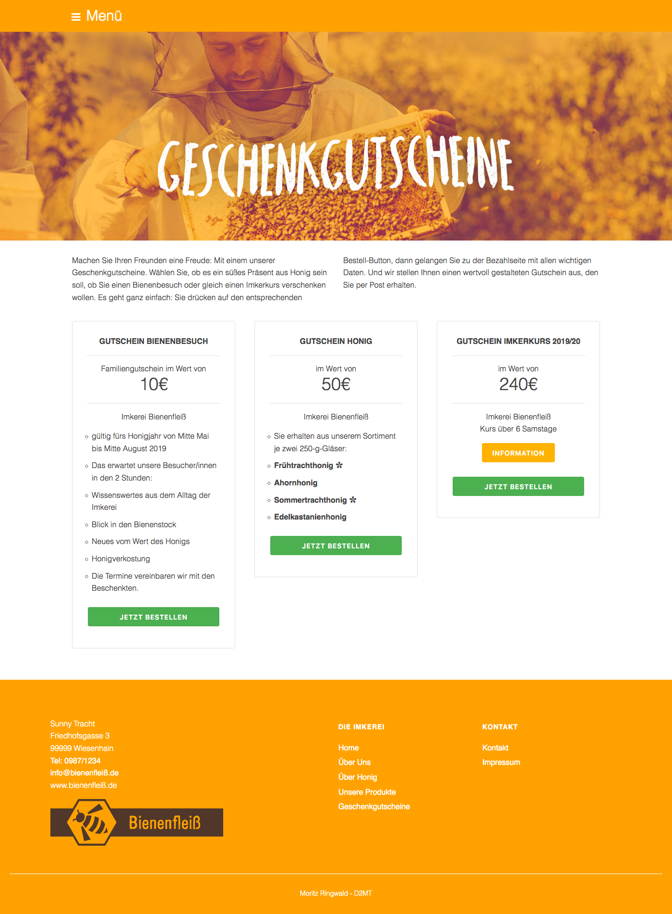
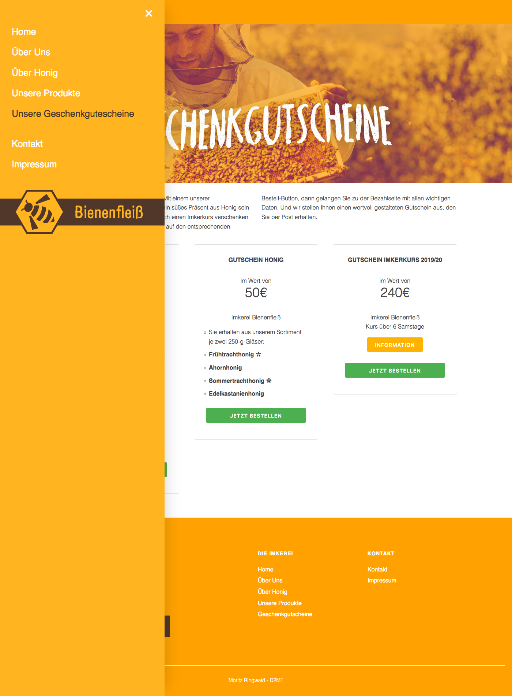

# azubi-mr.github.io

# readme Geschenkgutscheine.html

This project was created as a training for the upcoming Zwischenprüfung.

## General Information

All Text and Images are provided by GS-Lahr.

HTML created by Moritz Ringwald.

CSS based on Mustard UI Framework, adjusted by Moritz Ringwald

## Hard- and Software

This Website was build and tested using the following Hard- and Software:

> iMac 27“ late 2013 running macOS Sierra 10.12.6
>
> Brackets Editor 1.13.0-17696
>
> Firefox Quantum 68.0.1 (64-Bit) for macOS

Browser window size 1400px X 1200px

## Full Page Screenshots

### Default View

### Open Navigation View

## Authors

**Moritz Ringwald** *D2MT*

## Built With

[Mustard UI](https://mustard-ui.com/) - CSS Framework by Kyle Logue

## License

This project is licensed under the MIT License
